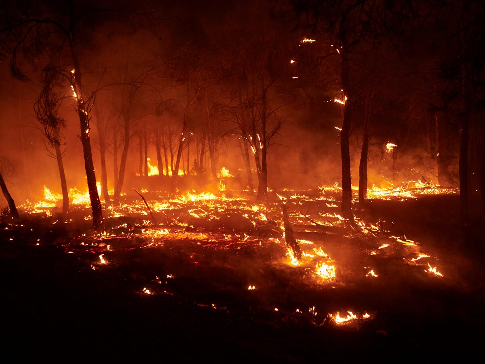
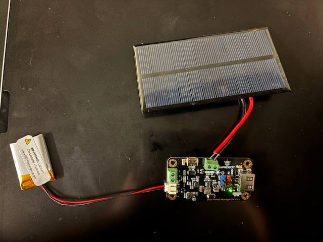
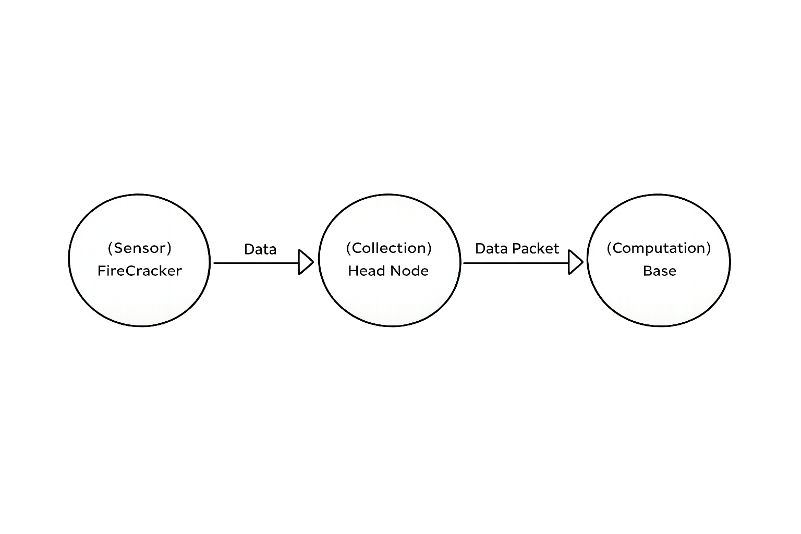

# FireCracker: Wildifre Prevention Project 

 

## Introduction:
FireCracker is an early wildfire detection system, with the goal of providing rural communities with a relaible and cost effective solution to combatting wildfires. Additionally the FireCracker project, will equip local-authorities with the data they need to save lives through our self-sustaining network of sensors that will monitor and prevent fires.

 
 

## Motivations
I grew up on the La Jolla Indian Reservation, a rural community that has previously been ravaged by fires such as the 2008 Poomacha wildfire. First-hand experience with wildfires, the power-outtages they produce and the fear of losing everything to them led me to create FireCracker.
Utilizing my background in research and Electrical Engineering, I aim to provide a robust solution for preventing wildfires and monitoring them. 

 
 

## Project Overview:

FireCracker is a project that aims to create a network of self-sustaining sensors that monitor  eviromental data for wildfire detection and prediction. Utilziing low power sensors to monitor temperature, humidity and other variables we can detect small fires and store that information for long term weather analysis.  

 

#### FireCracker Imgaes

 

## FireCracker Sensor Network Simplified Topology

The data pipeline for the FireCracker project is seperated, prioritizing low power consumption. FireCracker sensors serve as the data collection, data is aggregated at a head node, then sent for analysis to a computation node. Allowing FireCrackers to conduct sensing for prolonger periods of time, allowing them to be purely powered by a solar-panel.  

Additionally FireCrackers are not only fire detection sensors but weather stations. Providing weather data to rural communities and researchers with real-time information. 
 
 

## Skills: 
1. Data processing  
2. Pyserial 
3. ESPNOW   
4. Wire.h  
5. Embedded Systems  

 

## CAD:  
1. OnShape
 

## Programming Languages:  
1. C++  
2. Python  
