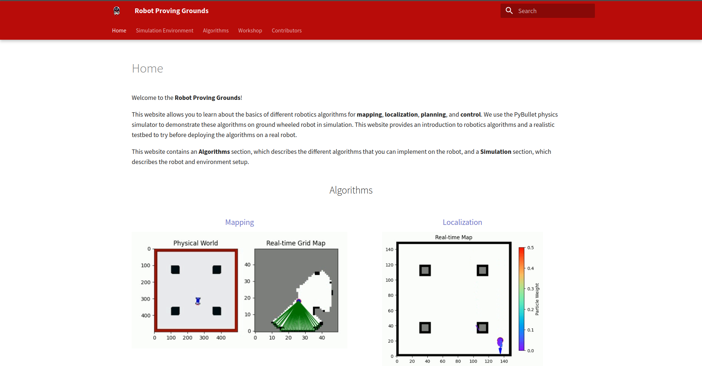
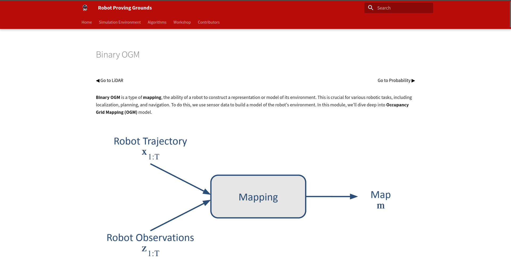
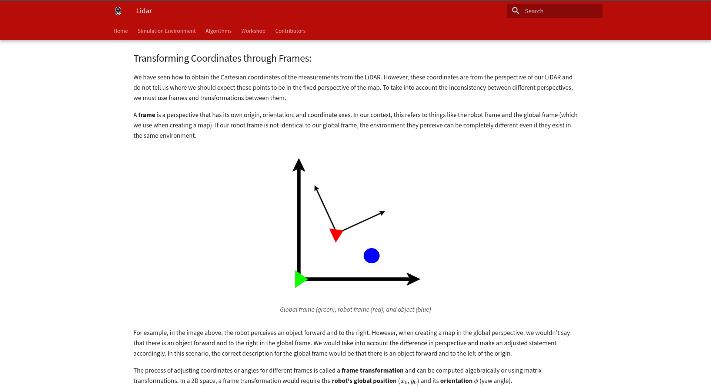

# Robotics Proving Grounds 

 

## Introduction
 
Contributed to the Robotics Proving Grounds, an educational robotics projects. 
Created the Lidar, Binary Occupancy Grid Mapping, and Probailistic Occupancy Grip Mapping, and Stanely Controller teaching modules.
Explained the purpose of mapping and control algorithms and theory.
 

##### Mapping:
Developed Control and Mapping algorithms to create an interactive learning platform.
Created Mapping algorithms, algorithms utilized within robotics to generate a 2D map of an enviroment. Explained the purpose between Binary and Probabilistic OGM algorithms and utilized a physics simulator to test and display their capabilities. 

##### Control:
Additionally created the Stanley Controller module, a control algorithm utilized for trajectory correction. The Stanely Controller calculates a desired point in front of a vehicle, by defining a circle derived from the geomety of the vehicle. Earning the Stanley Controller the nickname Dangling Carrot Controller. 

 
 

 

Lastly I created the Lidar section, a section explaining the use case of Lidar, a laser sensor crucial for conducting SLAM, and Mapping algorithms. Through the testing and development of these algorithms, we gained the ability break down complex algorithms into digestible modules that could help individuals intrested in robotics learn about the math powering autonomous robots. 

 

#### Intrested About Autonomous Robotics? Click The Link Below
 

[Robotics Proving Grounds](https://existentialrobotics.org/RobotProvingGrounds/)

 

## Skills: 
1. **Mapping Algorithms**  
    a. **Probabilistic** **OGM**  
    b. **Binary** **OGM**  
2. **Control Algorithms**  
    a. **Stanely Controller**  
    b. **Proportional Integral Controller** **PID**  
3. **Simulations**  
    a. **Pybullet** 
 

## Programming Languages:  
1. **Python**  

## Program: University of California San Diego' STARs 
- Lab: Exestential Robotic's Laboratory 
    - Mentor: Nikolay Antanasov 

