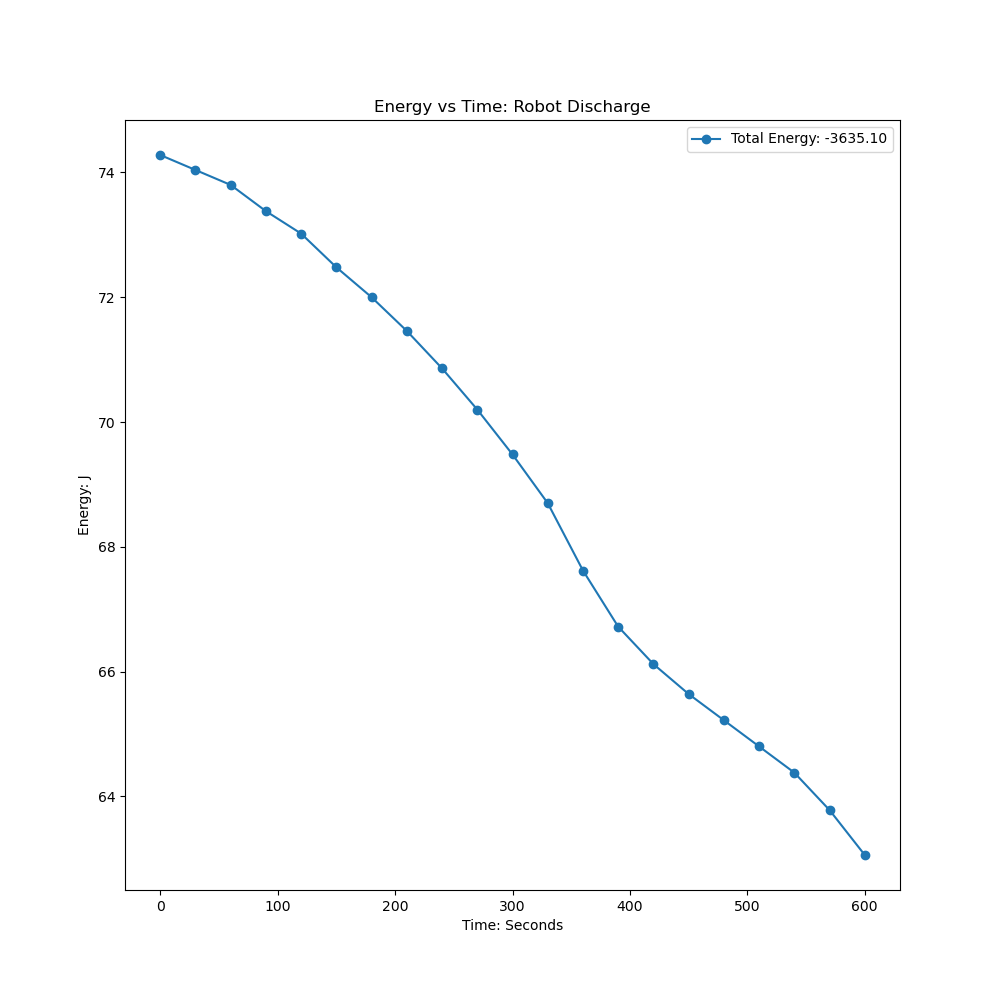

# Solar-Powered Rover

 
 

## Project Overview:

Utilizing Nasa solar-irradiance datasets, I was able to calculate the total energy-irradiance in a window of time during a summer day in Ann Arbor Michigan. Utilizing the average direct normal irradiance (DNI) I was able to calculate the total power generated in a day. Once I identified the potential solar-yield, I had to quantify the rover's potential power draw at different speeds. By conducting a power analysis of the system I was able to identify the total power consumed by the rover. Once I had obtained the direct normal irradiance, the average power draw of the rover by identifying a lower and upper bound for the power draw I could design a state of charge (SoC) simulation in Python. By creaing a SoC simulation of my battery's dynamics, I was able to better approximate the total power that the rover's solar panels must generate to increase it's operation time. Utilzing the SoC simulation, I was able to test many different solar panel configuraiton before buying them, allowing me to identify the most suitable panels. 

 
 

## Assembly
Once I had indentified how many the solar panels and which type of charge controller was needed for my solar-rover, I modeled it all in OnShape. By 3D modeling the rover, I was able to identify the placement of all my components and conduct some additional analysis on the angle of the solar panels. After indentifying that the most suitable configuration for the rover was zero-degrees, which avoided un-needed complexity. Once all the dimensions and electronics were placed correctly, I built the rover and assembled it within a week. After the rover was completed I compared the total idel and total moving power draw with the total power generated by the solar-panels. The total power draw mainly comes when the rover is running, since the motors consume a lot of power if rotating at high speeds.   
 

 
 

## Skills:  
1. Robotic Operating System (ROS2)  
2. Vicon Motion Capture System 
3. Linux (RaspberryPi) 
4. Solar 
5. Data Analysis  

## CAD:  
1. OnShape
 

## Programming Languages:  
1. C++ 
2. Python 
