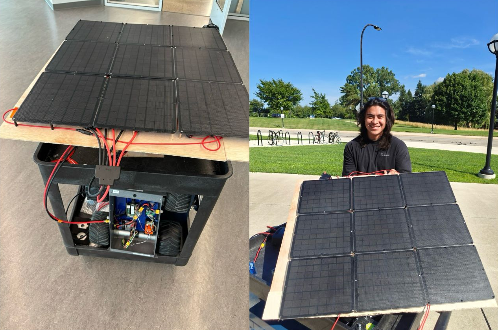
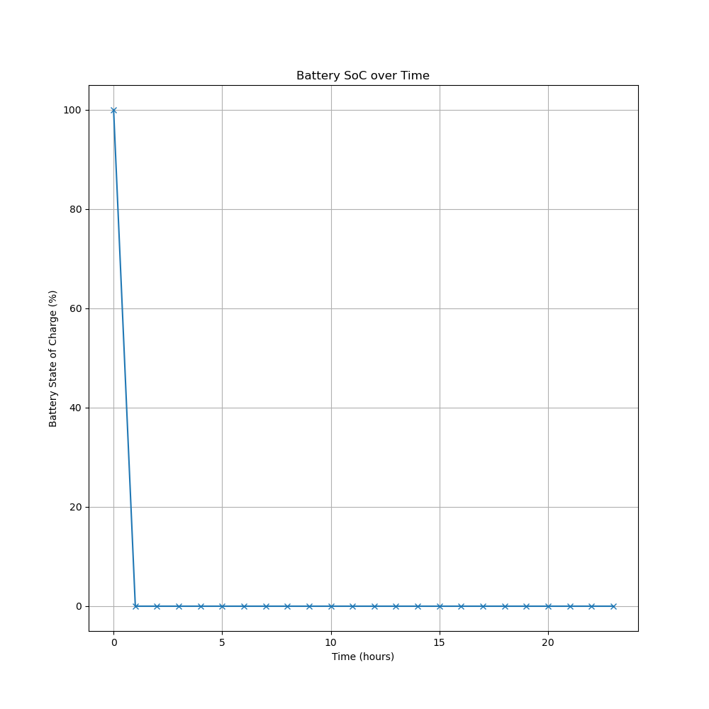
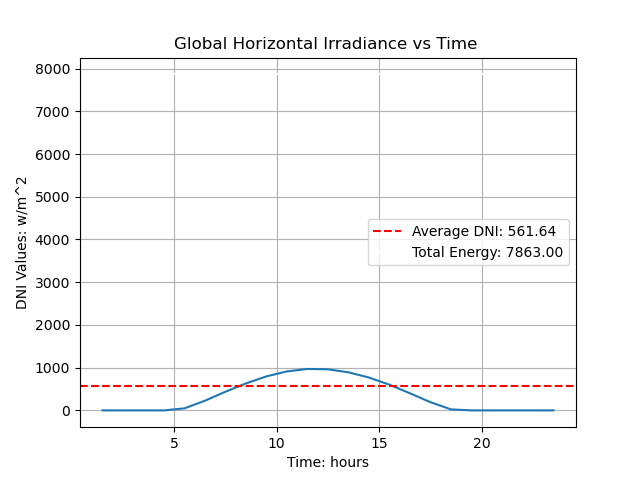
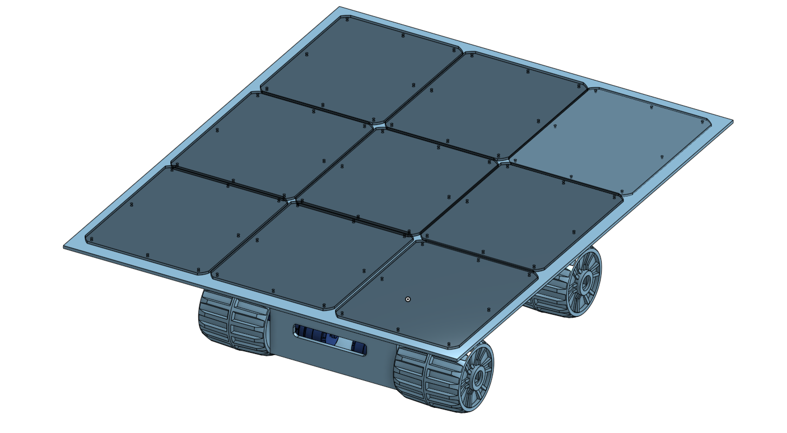
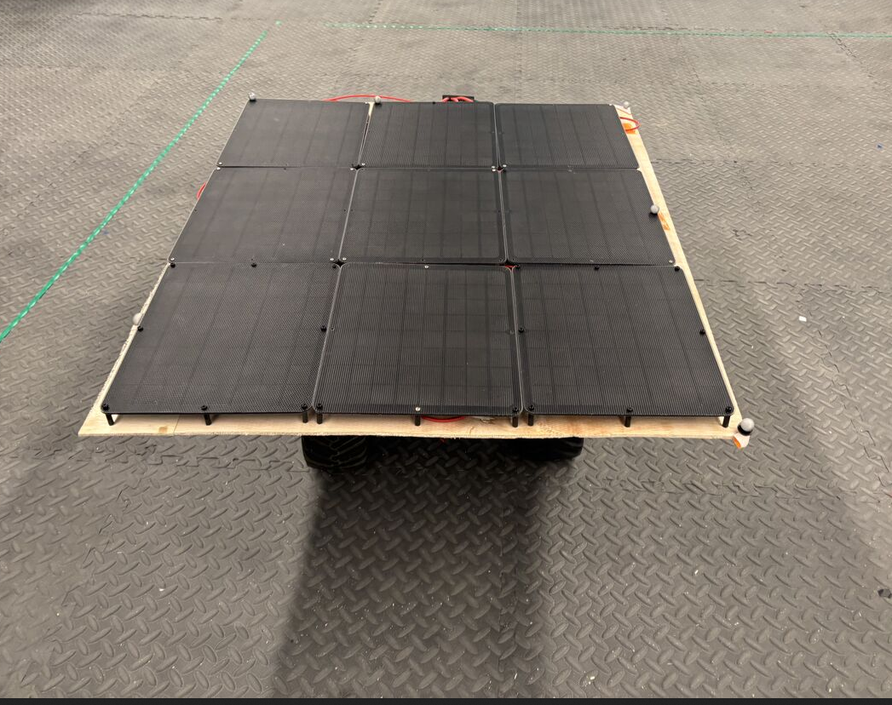

# Solar-Powered Rover

 
 

## Project Overview:

Analyzed solar-irradiance datasets, created state of charge (SoC) simulations of the system, designed and built a rover utilizing real-world data and simulations.

 
 

1. Utilizing Ann Arbor solar-irradiance data, calculated potential solar energy.  
2. Built and assembeled rover utilizing Raspberry-Pi, Px4 Orangecube.  
3. Conducted power profiling on the rover's varying power draws.  
4. Created state of charge simulation SoC, simulating the power harvested and consumed by rover.  
 
 

## Assembly

 

 
 

Using SoC simulations selected solar panels and electronical cthat would power the rover. Testing different configurations of solar-panels and many solar panel models to identify what would best power the rover during operation. Additionally selecting components that would arrive on time from different vendors.  

 

 

Once the solar-rover was completed, conducted additional power profiling to compare real-world preformance with simulation. Once tested the rover's 1hr battery duration was extended by 33%.  

## Skills:  
1. **Robotic Operating System (ROS2)**  
2. **Vicon Motion Capture System**  
3. **Linux (RaspberryPi)**  
4. **Solar**  
5. **Data Analysis**  
6. **Px4 OrangeCube**

## CAD:  
1. **OnShape**
 

## Programming Languages:  
1. **Python** 
2. **C++** 
