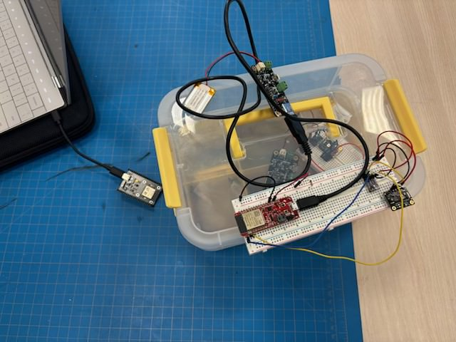

# Projects

 
 

#### Solar Rover 

 
 

#### FireCracker (Current)

 
 

#### Robotics Proving Grounds 

 
 

## Programming Languages:  
1. **Python**  
2. **C**  
3. **C++**  
 

## Software:
1. **Matplotlib**  
2. **Numpy**  
3. **Pybullet**  
4. **ROS2**  
 

## CAD:  
1. **OnShape**  
2. **Altium**  

